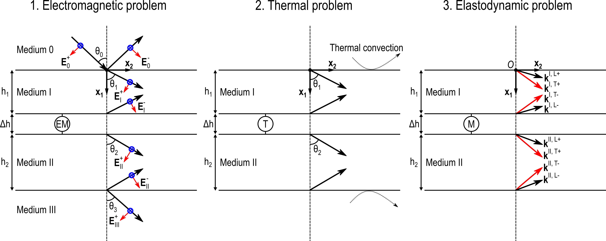

# Laser ultrasonics: Semi-analytic model

## General description

This Python code is designed to simulate laser-generated elastic waves in a multilayer structure based on a semi-analytic approach. Electromagnetic, thermal and elastodynamic problems are successively solved in 2D to obtain the displacement fields in the "upper" and "lower" media of the multilayer (medium I and medium II, respectively). The optical penetration of the incident tilted laser beam is accounted for, as well as thermal conduction and convection phenomena. 

<p align="center">
  
</p>

More information about this semi-analytic model (geometry, assumptions, detailed calculations, etc.) are provided in Ref. [[1]](#1).

## How to use?

1. Open the [Main.py](./Main.py) file

2. Define the position vector `x1_vec` where you want to calculate the displacement fields in the depth of the multilayer. Then, specify the `time` vector and the position vector `x2`. 

```python
x1_vec = [0.] # x1-position (mm), x1 between 0 and H, with H=h1+h2+dh
# Time, x2
dt = 8e-3 # Step t (µs)
dx2 = 0.08 # Step x2 (mm)
time = np.arange(0., 16.384, dt) # Time vector (µs)
x2 = np.arange(-81.92, 81.92, dx2) # x2 vector (mm)
```

*Remark: it is recommended to choose a power of 2 for the length of the *`time`* vector and the *`x2`* vector. The Nyquist–Shannon sampling theorem must also be respected when defining the *`time`* and *`x2`* vectors to prevent aliasing effects.*

3. Define thicknesses, densities and optical/thermal/mechanical parameters of media I, II and sublayer(s):

* Optical parameters: complex refractive index, magnetic permeability;
* Thermal parameters: thermal conductivities, specific heat, thermal expansion coefficients;
* Mechanical parameters: viscoelastic coefficients (Kelvin-Voigt model).


4. Define the parameters of the incident electromagnetic wave and detection parameters of the interferometer:

* Incident electromagnetic wave parameters: optical wavelength, angle of incidence, intensity, pulse shape (time and space);
* Detection parameters of the interferometer: width at half maximum of the Gaussian detection spot, bandwidth.

5. Run the [Main.py](./Main.py) script

The electromagnetic, thermal and elastodynamic problems are successively solved and the results are plotted with `matplotlib.pyplot`. 

## Examples

Some numerical results obtained with this semi-analytic model are shown below. 

* For an aluminum alloy plate (4.6&nbsp;mm-thick), the normal displacement field is plotted as a function of time to obtain this ".gif" animation:

<p align="center">
  
</p>

* In the Figure below, two results are plotted:
	- In Fig. (a): the normal displacement field is plotted at t=1&nbsp;&#956;s in two perfectly coupled aluminum alloy plates&nbsp;(Al); 
	- In Fig. (b): the normal displacement field is plotted at t=1&nbsp;&#956;s in a trilayer Al&nbsp;(1.5&nbsp;mm)/Epoxy&nbsp;(0.1&nbsp;mm)/Al&nbsp;(3.0&nbsp;mm). 
<p align="center">
  
</p>

* In the Figure below, two results are plotted:
	- In Fig. (a): the normal displacement field is plotted at t=0.35&nbsp;&#956;s in a bilayer structure composed of a 2 mm-thick glass plate (Schott&nbsp;N-BK7&#174;) mechanically coupled to a 2 mm-thick titanium plate with two distributions of normal and transverse interfacial stiffnesses (`K_N` and `K_T`); 
	- In Fig. (b): the normal displacement field is plotted at t=0.35&nbsp;&#956;s in two perfectly coupled glass (Schott&nbsp;N-BK7&#174;) and titanium plates.
	
<p align="center">
  
</p>

More precisions on these examples and more numerical results are provided in Ref. [[1]](#1).

## Configuration

This Python code is created with Anaconda, under the scientific environment Spyder.

```python
Python 3.7.3 (default, Apr 24 2019, 15:29:51) [MSC v.1915 64 bit (AMD64)]
Type "copyright", "credits" or "license" for more information.

IPython 7.6.1 -- An enhanced Interactive Python.
```

The conda environment used is specified in the [spec-file.txt](./conda_environment/spec-file.txt).

## More information

Details about this semi-analytical model are provided in the article:

<a id="1">[1]</a>
R. Hodé, M. Ducousso, N. Cuvillier, V. Gusev, V. Tournat and S. Raetz, "Laser ultrasonics in a multilayer structure: Semi-analytic model and simulated examples," J. Acoust. Soc. Am. (submitted on December 11, 2020).